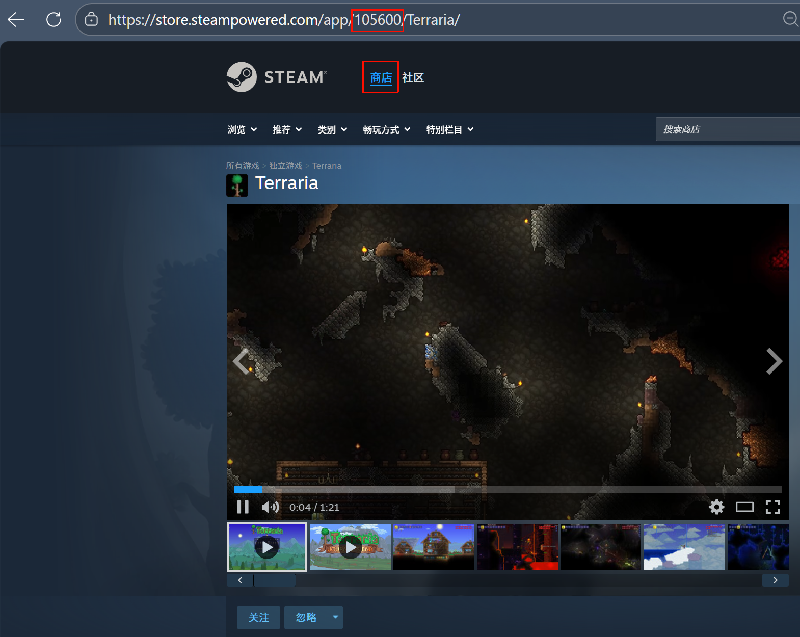

# 游戏推荐图制作器

一个用于快速生成游戏推荐图片的工具，支持从Steam获取游戏信息和截图，或使用本地图片，自定义游戏名称、标签、水印等信息，并导出为多种格式。

## 功能特性

### Steam 集成
- 通过 Steam AppID 自动获取游戏信息（名称、价格、评分、标签）
- 自动拉取并展示游戏官方截图，支持选择两张作为推荐图素材
- 智能识别折扣价格，自动显示原价和现价

### 图片处理
- 支持从 Steam 截图中选择两张图片
- 支持本地上传两张图片（上方和下方）
- 自动按比例缩放图片，保持画面完整

### 自定义编辑
- 支持自定义游戏名称（主标题和副标题）
- 可调整标题和标签的字体大小
- 支持添加自定义标签
- 可添加水印文本
- 支持自定义价格和评分信息

### 导出功能
- 支持导出为 PNG（无损）、JPG（体积更小）、WebP（高压缩率）格式
- 支持将多张生成的图片加入文件夹
- 支持将文件夹中的图片导出为 ZIP 包

### 界面设计
- 响应式布局，适配不同屏幕尺寸
- 直观的拖拽和点击操作
- 实时预览生成效果
- 流畅的动画效果


## 安装与使用

### 1. 克隆项目

```bash
git clone <repository-url>
cd 游戏推荐图制作器
```

### 2. 安装依赖

```bash
npm install
```

### 3. 启动后端服务

```bash
node steam-proxy.js
```

后端服务将在 `http://localhost:3000` 启动，用于：
- 代理 Steam API 请求（解决跨域问题）
- 处理 ZIP 导出功能

### 4. 打开前端页面

直接在浏览器中打开 `index.html` 文件即可开始使用。

## 使用教程

### 如何获取 Steam AppID

Steam AppID 是游戏在 Steam 商店中的唯一标识符，您可以通过以下方式获取：

1. 打开 Steam 商店页面，找到您想要制作推荐图的游戏
2. 在浏览器地址栏中，您会看到类似 `https://store.steampowered.com/app/105600/Terraria/` 的 URL
3. URL 中 `app/` 后面的数字就是该游戏的 Steam AppID（例如上面链接中的 `105600`）



### 方法一：使用 Steam 游戏信息

1. 在「Steam 官方信息与截图」输入框中输入游戏的 Steam AppID
2. 点击「获取」按钮，系统会自动拉取游戏信息和截图
3. 从显示的截图中选择两张（系统会默认选择前两张）
4. 可根据需要修改游戏名称、标签、价格、评分等信息
5. 点击「生成推荐图」按钮预览效果
6. 点击「下载当前图片」选择格式并下载，或点击「加入文件夹」保存到本地文件夹

### 方法二：使用本地图片

1. 在「图片来源」中选择「本地图片」
2. 点击「选择图片 1」和「选择图片 2」上传两张本地图片
3. 填写游戏名称、标签、价格、评分等信息
4. 点击「生成推荐图」按钮预览效果
5. 点击「下载当前图片」选择格式并下载，或点击「加入文件夹」保存到本地文件夹

### 导出文件夹

1. 点击右下角的文件夹图标打开图片文件夹
2. 可在文件夹中查看已保存的图片
3. 点击「导出 ZIP」按钮将所有图片打包下载

## 开源协议

本项目采用 MIT 开源协议。

